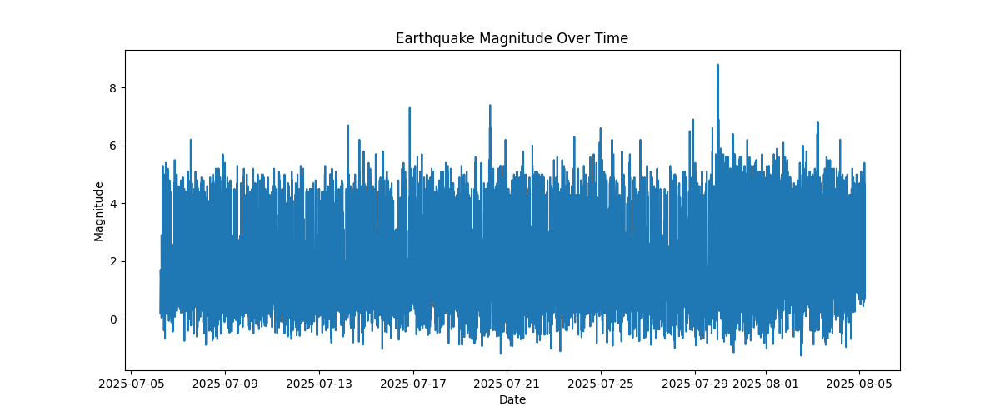
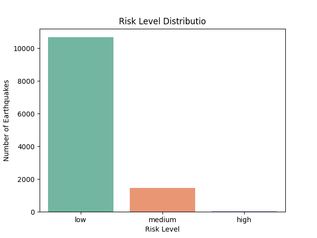

# 🌍 Earthquake Risk Assistant

An AI-powered assistant that predicts **earthquake risk levels** (low, medium, high) using real-time data and machine learning. Built for disaster awareness, data science practice, and potential real-world applications.

---

## 🚀 Project Overview

This project uses historical earthquake data from [USGS](https://earthquake.usgs.gov) to train a machine learning model that classifies the **risk level** of earthquakes based on features like:

- Magnitude
- Depth
- Latitude
- Longitude

The model achieves **99.9% accuracy** and is enhanced with data visualization to support interpretation.

---

## 📊 Visualizations

### 🔥 Earthquake Magnitude Over Time


### 📉 Earthquake Risk Level Distribution


---

## 🧠 Machine Learning Model

- **Model**: Random Forest Classifier
- **Accuracy**: 99.96%
- **Features used**:
  - `mag` — magnitude
  - `depth` — depth of earthquake
  - `latitude`, `longitude` — geographical location

> The model is trained using `scikit-learn` and performs multi-class classification (`low`, `medium`, `high` risk).

---

## 📁 Project Structure

```
├── Earthquakes risk.ipynb       # Main notebook with code
├── requirements.txt             # List of required libraries
├── screenshots/                 # Folder with visualizations
└── README.md                    # This file
```

---

## 🧪 How to Run

1. Clone this repository
2. Install dependencies:
```bash
pip install -r requirements.txt
```
3. Open the notebook and run all cells

---

## 📌 Future Plans

- 🤖 Build a Telegram bot for instant risk predictions
- 🌐 Deploy as a Streamlit web app
- 🌍 Integrate live earthquake data via API

---

## 🙌 Author

Made with ❤️ by a passionate student & ML enthusiast.  
For competitions, learning, and real-world impact.

